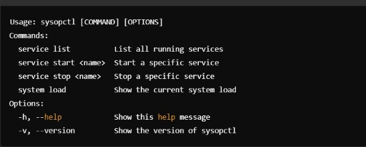
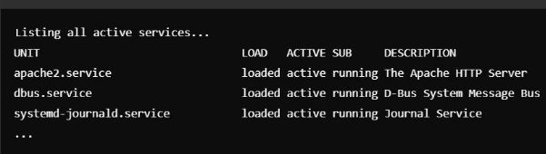

\# sysopctl sysopctl is a command-line tool for managing Linux system services, processes, and system health. It allows you to list, start, stop services, and check the system's load. ## Installation Clone the repository and add `sysopctl.sh` to your system’s `PATH`. ## Usage ```bash sysopctl --help sysopctl --version sysopctl service list sysopctl service start apache2 sysopctl system load


command


output



command


output


command


output



command


output


